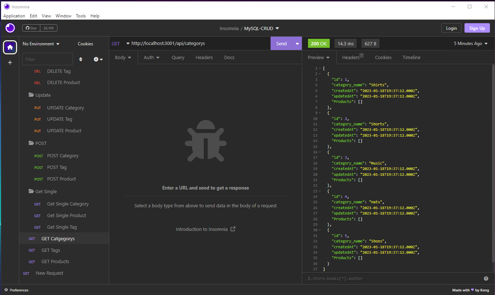

    
# MySQL_CRUD_routes

## Table of Contents
* [Project Description](#description)
* [Installation](#install)
* [Contribution Notes](#contribution)
* [Usage Info](#usage)
* [Test Info](#test)
* [Contact Info](#contact)
* [Deployed Link](#deployed)
* [Screenshot](#screenshot)

## Description
A simple app that utilizes NPM packages MySQL, Sequelize, and Dotenv, and Express to use CRUD routes to manipulate data in a database

## Install
A computer with an application to view/run code. the ability to download NPM packages MySQL, Sequleize, Dotenv, and Express. And Insomnia app to test routes

## Contribution
Please review package-lock.json file

## Usage
Public

## Test
NaN

## Contact
If you have any Questions or concerns please reach me via my E-mail or through GitHub  
rasvindra@hotmail.com  
[github.com/rasvindra](https://github.com/rasvindra)

## Deployed
https://youtu.be/_fqONINShWM

## Screenshot

